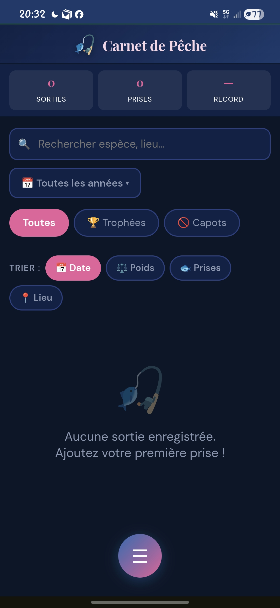
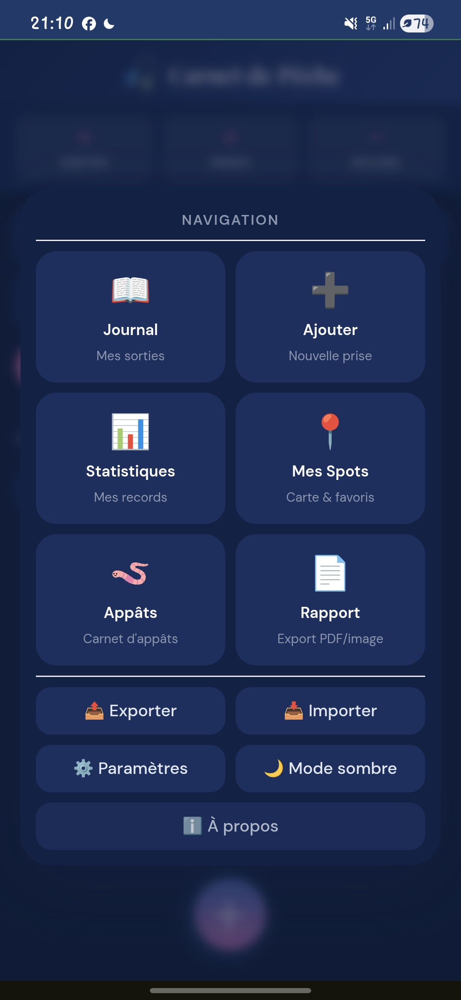
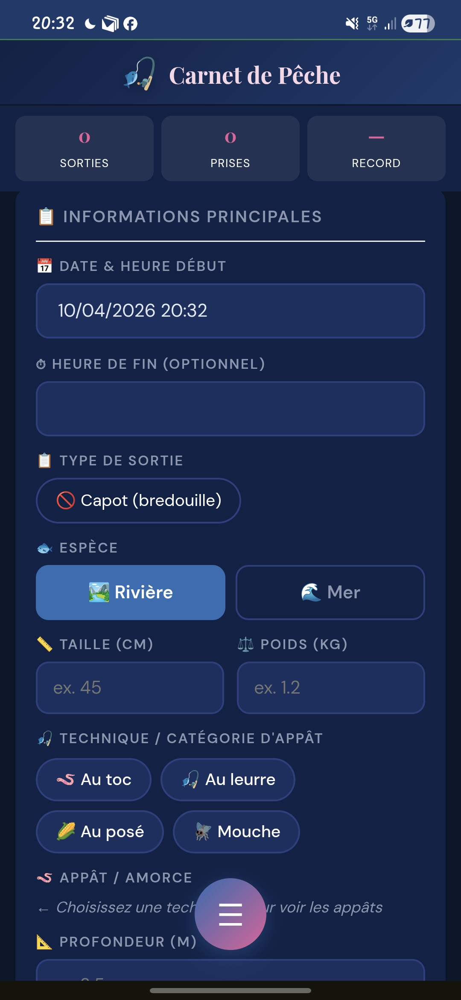

# 🎣 Carnet de Pêche Pro
**Une application PWA moderne pour le suivi de vos sessions de pêche.**

Carnet de Pêche est un outil léger et privé, conçu pour les pêcheurs qui souhaitent garder une trace précise de leurs prises sans compromettre la confidentialité de leurs coins de pêche.

## ✨ Points Forts
* **Privé par design** : Aucune donnée n'est envoyée à un serveur tiers. Tout reste dans votre navigateur (LocalStorage).
* **Expérience Mobile** : Installable comme une application native grâce à la technologie PWA.
* **Automatisation** : Récupération automatique de la météo (Open-Meteo) et des phases de la lune.
* **Zéro Tracking** : Pas de revente de données, pas de compte utilisateur obligatoire.

## 🚀 Fonctionnalités
- **Saisie intelligente** : Sélecteur Mer/Rivière, gestion des appâts et espèces.
- **Cartographie** : Visualisation précise de vos prises via Leaflet.js.
- **Statistiques** : Analyse dynamique par année et par espèce avec interface tactile.
- **Sécurité des données** : Système de snapshots (sauvegardes automatiques) et export/import JSON.

## 📄 Licence & Usage
Ce projet est publié sous licence **Source Available**.
* **Usage Personnel** : Gratuit et encouragé.
* **Usage Commercial** : Strictement interdit sans autorisation.
* **Code** : La copie partielle ou totale du code source pour redistribution est interdite.

*Pour toute demande de licence commerciale ou suggestion majeure, merci de me contacter via GitHub.*

---
*Version 1.1 Stable - Développé avec passion pour la communauté des pêcheurs.*

  

  

  

